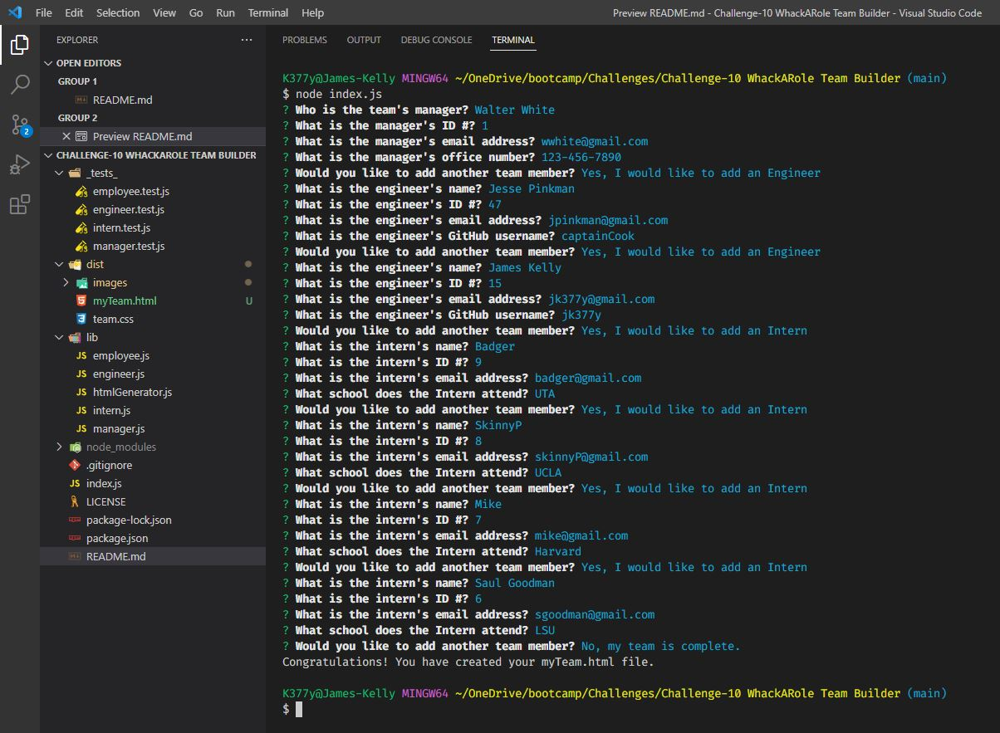
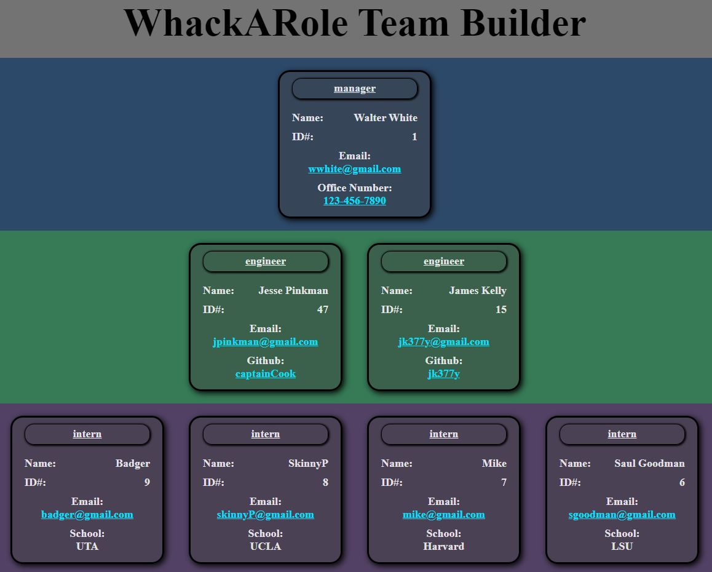

# WhackARole Team Builder  
Your challenge is to build a Node.js command-line application that takes in information about employees on a software engineering team and generates an HTML webpage that displays summaries for each person. 

## Description
By entering user inputs from the command line, I am able to build a team of 1 manager, and any number of engineers and interns and generate an HTML document that displays that team composition.

## Table of Contents
- [Installation](#installation)
- [Usage](#usage)
- [Testing](#testing)
- [Questions](#questions)
- [License](#license)
- [Contributing](#contributing)

## Installation
You must have node.js installed on your system. 
Run [npm install inquirer]. This will allow acces to the "Inquirer" package module which allows input values to be entered when prompted with questions.  
Run [npm install jest]. This will allow access to the "jest" pacakage which provides testing functionality. 
You need to import access from the 'fs' module. This provides functionality for writing files via writeFile and writeFileSync. [const fs = require('fs')] 
You need to import access from the 'path' module. This provides a way to work with directories and filepaths. [const path = require('path')] 

## Usage
 Video Walkthrough Link
 https://drive.google.com/open?id=1pP-L--_lxopiTUjWENZ5UAeLnCltkKGv&authuser=0&usp=drive_link  

While using VSCode, use the integrated terminal feature while in the root directory where the index.js file is located, run the command [node index.js]. Answer the questions.  Once you are satisfied with the team you have built, you can choose the option to build your team. This will exit the program and generate an HTML document. 
 
 

## Testing
Open the integrated terminal in VS Code and navigate to the root directory where the index.js file is located. 
You can start the test by running [npm run test] 
 

## Questions
For Questions, I can be reached at the following:
 GitHub:  https://github.com/jk377y
 OR
 Email:  jk377y@gmail.com

## Contributing
NPM - npmjs.com (for research and documentation referencing) 
You can help support me by donating with Cash App @ $JK377Y

## License
License: MIT
  
 Copyright (c) 2023 James Kelly
 Information on this license can be found at: (https://opensource.org/licenses/MIT)

